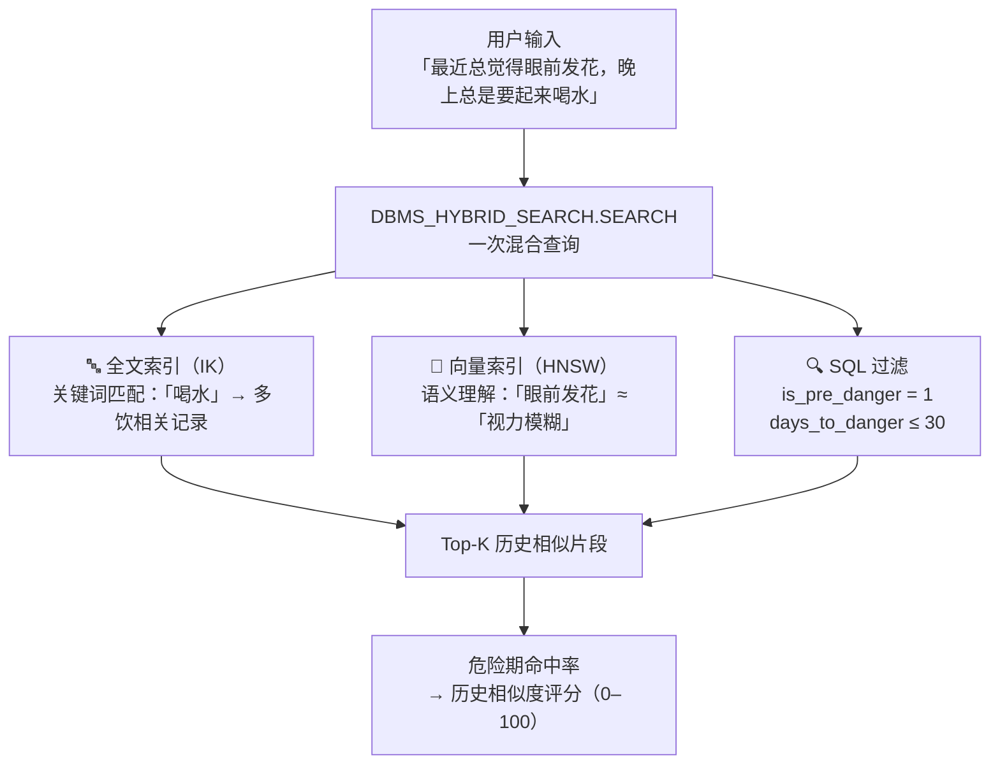

# 🩺 慢病早期预警 Agent — SeekDB Demo

基于 **SeekDB**（OceanBase AI-native 数据库）的[个性化健康风险评估 demo](https://69a8fc882375cb0b46626fd9--coruscating-mousse-9729de.netlify.app/)。

用户每天写一段健康日记，系统就会给出一个风险评估，并随着使用时间的增长越来越"了解"这个用户。产品的所有核心分析——人群对比、趋势追踪、基线计算、实验分析、反馈矫正——**全部由 SeekDB 的混合搜索和 SQL 能力承载，无需额外引入向量数据库或搜索引擎**。

---

## 产品功能用例

### 用例一：每日风险检测

用户用自然语言描述今天的感受，可附上血糖和血压数值。系统在数秒内完成三路分析，给出一个 0–100 的综合风险评分，并说明评分构成。

**四路分析信号：**

| 信号 | 含义 | 触发条件 |
|------|------|----------|
| 🔍 历史相似度 | 今天的描述与历史人群"危险事件前 30 天"的相似程度 | 始终生效 |
| 📈 近期变化趋势 | 用户自身血糖和描述的近 7 日变化方向 | 积累 3+ 条记录后 |
| 🧬 与平日的差异 | 今天的状态与用户自身平时健康状态的偏离程度 | 积累 7+ 条记录后 |
| 💭 情绪-生理耦合 | 今日情绪状态对风险评分的个性化调节 | 积累 5+ 条记录，且情绪与风险相关度 \|r\| > 0.3 后 |

随着记录增多，系统会从「人群参考模式」切换到「个人模型模式」，评估越来越个性化。每次提交还会收到一条具体可执行的健康干预建议。


---

### 用例二：健康趋势档案

「我的档案」Tab 聚合用户自身的健康历史，提供：

- **风险评分趋势图**：所有记录的历史风险走势，危险/稳定节点一眼可见
- **血糖变化曲线**：叠加临界参考线，直观看出控糖状态
- **历史记录表**：近 30 条日记的日期、风险评分、血糖、日记摘要
- **系统学习进度**：已收集的预警反馈数、预测相符率、当前矫正方向（见用例四）


---

### 用例三：健康实验

用户可以设计一个自己的"变量控制实验"，比如：

> 「我想知道晚饭后散步 30 分钟，是否真的影响我的血糖和整体感受。」

**操作流程：**
1. 创建实验，写下观察内容（"晚饭后步行 30 分钟"）和预期效果
2. 每天打卡——今天执行了 ✓ 还是跳过了 ✗
3. 积累足够数据后（3+ 执行日 + 2+ 对照日），系统对比两组结果：
   - **客观指标**：执行日 vs. 未执行日的平均风险值和血糖
   - **主观感受**：两种状态下日记描述的整体差异程度

所有实验结论均为相关性分析，不代表因果关系。


---

### 用例五：情绪-生理耦合分析

「我的档案」Tab 分析用户的情绪状态与生理风险之间的关联规律，帮助用户理解心理健康如何影响慢病风险。

**分析内容：**

- **情绪评分**：从每条日记的关键词中自动计算 0–100 分的情感状态（50 为中性，100 为完全积极）
- **Pearson 相关系数（r）**：量化情绪与风险的同日关联强度
- **滞后分析（lag-1）**：今天的情绪 → 明天的风险，捕捉情绪的前瞻性影响
- **分组均值对比**：低风险日与高风险日的平均情绪分差异

当 |r| > 0.3 时，情绪-生理耦合被激活，情绪信号正式进入评分模型，权重为 15%，并根据个人耦合强度动态调整放大系数（最高 1.2×）。

「我的档案」Tab 显示双轴折线图（风险评分 vs. 情绪评分）及中文解读文字，个人参数面板中也会显示耦合状态和相关系数。


---

### 用例六：微干预推荐

每次提交日记后，系统在 Tab 1 底部推荐**恰好一条**具体可执行的健康干预建议，而非泛泛的健康提示。

**推荐逻辑（优先级从高到低）：**

| 优先级 | 触发条件 | 示例建议 |
|--------|----------|----------|
| P3 紧急 | 日记含「急诊」「晕倒」「抽搐」等紧急词 | 立刻联系家属或拨打急救电话 |
| P3 极高血糖 | 血糖 > 280 mg/dL | 立即复测；若仍超 16.7 mmol/L 请就近急诊 |
| P3 高风险+危险症状 | 高风险 + 「严重头晕」「视力模糊」等 | 今日内联系主治医生 |
| P2 高风险 | 风险等级为「high」 | 空腹血糖监测 |
| P2 中风险+趋势恶化 | 中风险 + 近 7 日趋势变差 | 空腹血糖监测 |
| P1 日记内容 | 日记含睡眠/压力/饮食/久坐关键词 | 今晚10点关屏幕 / 腹式深呼吸5分钟 |
| P1 个人档案 | 个人 trigger_symptoms 匹配 | 餐后2小时测血糖 / 泡脚助眠 |
| P0 默认 | 无其他信号 | 全天保证喝够1500 mL白开水 |

推荐卡片以颜色区分紧急程度（红/黄/绿），并显示建议类别、干预文本和一行推荐理由。系统还会检查用户当前进行中的健康实验，避免推荐与实验变量重叠的建议。


---

### 用例四：预警反馈闭环

每次评估 48 小时后，系统会主动询问：**「当时的预警准不准？」**

用户回答「确实变差了 / 没明显变化 / 反而好转了」，系统积累反馈后自动调整**个人敏感度**：

```
如果历史上总是漏报 → 自动调高灵敏度（最多 +30%）
如果历史上偶有过度预警 → 自动降低灵敏度（最多 -30%）
```

积累 5 条以上反馈后生效，矫正系数范围 `[0.7, 1.3]`，下次评分自动应用。「我的档案」Tab 实时显示学习进度。

---

## SeekDB 在本项目中的作用

SeekDB 是 OceanBase 推出的 AI 原生数据库，兼容 MySQL 协议，同时内置全文索引、向量索引和关系型 SQL，三者共用一个存储引擎，可在**一条 SQL** 内完成混合查询。本项目所有核心分析均建立在这一能力之上。

### 作用一：人群轨迹对比（混合搜索）

这是本项目最核心的 SeekDB 使用场景。`patient_diaries` 表存储 4,500 条合成历史患者记录，同时建立：

- **全文索引（IK 中文分词）**：精确匹配症状关键词，例如"口渴""头晕""夜尿"
- **向量索引（HNSW）**：捕捉语义等价表达，例如"眼前发花"和"视力模糊"语义相近

每次用户提交日记，系统发出 **一条** `DBMS_HYBRID_SEARCH.SEARCH` SQL，同时完成关键词匹配 + 含义理解 + SQL 字段过滤（`is_pre_danger`、`days_to_danger`），在历史人群中找到最相似的片段，并计算其中"危险事件前 30 天"的比例作为轨迹风险信号。



**混合搜索为何优于单一方式：**

| 方式 | 能力 | 局限 |
|------|------|------|
| 纯关键词 | 精确匹配医学术语 | 漏召回同义描述（"眼前发花"≠"视力模糊"） |
| 纯含义理解 | 捕捉语义等价表达 | 难以区分"普通疲惫"和"高血糖疲惫" |
| **SeekDB 混合** | **两者互补，精准识别预警信号** | — |

---

### 作用二：个人趋势分析（SQL 时序查询）

`user_diaries` 表存储用户自己的每日记录（日记文本、血糖、血压、风险评分等）。系统通过普通 SQL 查询最近 7 条记录，在应用层计算血糖斜率和描述变化趋势，生成「近期变化」信号。

SeekDB 的 MySQL 兼容性让这部分分析与混合搜索复用同一套连接和表设计，无需切换系统。

---

### 作用三：个人基线计算（向量存储）

`user_diaries` 中每条记录都存有一个 384 维的向量（日记文字经语言模型编码）。`user_baseline` 表存储所有历史向量的**质心**（算术平均）。

每次提交新日记时，系统计算今日向量与质心的余弦距离，距离越大说明今天的状态与平时差异越大，转化为「与平日的差异」信号。

向量直接存在 SeekDB 的 `VECTOR(384)` 列中，写入和读取均通过标准 SQL 完成。

---

### 作用四：健康实验分析（SQL JOIN + 向量质心对比）

实验分析是 SeekDB 同时发挥 SQL 和向量能力的第二个典型场景。

`experiment_logs` 表记录每天是否执行实验，通过 `JOIN user_diaries` 完成两层分析：

```sql
-- ① SQL 层：均值对比
SELECT el.executed,
       AVG(ud.risk_score)    AS avg_risk,
       AVG(ud.glucose_level) AS avg_glucose
FROM experiment_logs el
JOIN user_diaries ud ON el.diary_id = ud.id
WHERE el.experiment_id = ?
GROUP BY el.executed;
```

```
-- ② 向量层：主观感受差异
取执行日所有 diary_embedding → 计算质心 A
取未执行日所有 diary_embedding → 计算质心 B
余弦距离(A, B) 越大 = 两种状态下的感受描述差异越明显
```

---

### 作用五：反馈矫正（结构化存储 + JOIN 统计）

`risk_feedbacks` 表存储每次用户对历史预警的回访结果。系统通过 SQL JOIN 统计漏报率和误报率：

```sql
SELECT ud.risk_level, rf.actual_outcome
FROM risk_feedbacks rf
JOIN user_diaries ud ON rf.diary_id = ud.id
```

依此计算个人敏感度矫正系数，在下次评分时作为乘数应用到最终结果上。

---

### 作用六：情绪-生理耦合缓存（专用结构化表）

`emotion_coupling` 表缓存每次耦合分析的结果（Pearson r、lag-1 相关、低/高风险日情绪均值、解读文字），避免每次进入「我的档案」Tab 都重算 Pearson 相关：

```sql
-- 写入（每次用户档案刷新后）
DELETE FROM emotion_coupling;
INSERT INTO emotion_coupling
    (correlation, lag1_correlation,
     mean_emotion_low_risk, mean_emotion_high_risk,
     interpretation, data_points)
VALUES (?, ?, ?, ?, ?, ?);

-- 读取
SELECT * FROM emotion_coupling ORDER BY id DESC LIMIT 1;
```

`user_profile` 表同时存储四个情绪相关个性化参数：`emotion_risk_coupling`（相关系数）、`emotion_volatility`（情绪波动度）、`emotion_amplification`（放大系数 1.0–1.2）、`emotion_active`（是否激活布尔值），在评分时由 `fuse()` 读取并合并为第四路信号。

---

## 数据库表设计总览

```
SeekDB（8 张表）
│
├── patient_diaries       历史人群数据（4,500 条合成记录）
│   ├── FULLTEXT INDEX    IK 中文分词，匹配症状关键词
│   └── VECTOR   INDEX    HNSW 384 维，匹配描述含义
│
├── user_diaries          用户自己的每日记录
│   ├── FULLTEXT INDEX    支持未来关键词回溯
│   ├── VECTOR   INDEX    存储个人日记向量
│   └── + emotion_score / anxiety_score 列（情绪分析扩展）
│
├── user_baseline         个人健康基线（向量质心，每次记录后刷新）
│
├── experiments           健康实验元数据
│
├── experiment_logs       每日执行打卡记录（关联 user_diaries）
│
├── risk_feedbacks        用户对历史预警的反馈（关联 user_diaries）
│
├── user_profile          个性化参数向量（5 维：血糖敏感度、提前量、
│                         风险词、噪声带、情绪-风险耦合参数）
│
└── emotion_coupling      情绪-生理耦合分析缓存
                          （Pearson r、lag-1、低/高风险日情绪均值）
```

---

## 快速启动

```bash
# 1. 克隆仓库
git clone https://github.com/ErinYu/seekdb-health-demo.git
cd seekdb-health-demo

# 2. 安装依赖
pip install -r requirements.txt

# 3. 配置环境变量（可选：填入 Anthropic API key 以启用 AI 分析）
cp .env.example .env

# 4. 启动 SeekDB
docker-compose up -d
# 等待约 30 秒完成初始化

# 5. 初始化数据库（含模型下载 + 数据写入，约 3~5 分钟）
python3 scripts/init_db.py

# 6. 启动应用
python3 app.py
# 浏览器打开 http://localhost:7860
```

**环境要求：**

| 工具 | 版本 |
|------|------|
| Python | 3.10+ |
| Docker | 24+ |
| Docker Compose | v2 |

---

## 项目结构

```
seekdb-health-demo/
├── app.py                    # Gradio UI（Tab 1 日检 + Tab 2 档案 + Tab 3 实验）
├── docker-compose.yml        # SeekDB 容器配置
├── requirements.txt
├── .env.example
├── scripts/
│   └── init_db.py            # 一键初始化数据库
└── src/
    ├── db.py                 # 数据库连接与重试
    ├── schema.py             # 8 张表的 DDL + ALTER 语句
    ├── data_generator.py     # 合成患者数据生成器
    ├── ingest.py             # 向量编码 + 批量写入 + 表初始化
    ├── embedder.py           # 语言模型单例（384 维）
    ├── searcher.py           # 混合搜索 + 风险评分
    ├── user_store.py         # 用户日记 CRUD + 基线刷新
    ├── trend_analyzer.py     # 7 日趋势分析（线性回归）
    ├── baseline.py           # 向量质心距离计算
    ├── scorer.py             # 四路信号融合评分（含情绪信号）
    ├── user_profile.py       # 个性化参数向量计算与持久化
    ├── emotion.py            # 情绪评分 + 耦合分析 + 波动度
    ├── recommender.py        # 微干预推荐引擎（单条可执行建议）
    ├── experiments.py        # 健康实验 CRUD + 分析
    ├── feedback.py           # 预警反馈 + 敏感度矫正
    └── agent.py              # LLM 分析（Claude / 规则兜底）
```

---

## 数据说明

所有数据均为**完全合成数据**，由 `src/data_generator.py` 程序化生成：

- 100 名虚拟患者（40 名在模拟期结束时出现血糖危机，60 名保持稳定）
- 每位患者 45 天记录，共约 4,500 条
- 危机患者最后 25 天血糖按 S 曲线上升至 210–320 mg/dL
- 日记文本基于医学文献症状描述模板生成，不含任何真实个人信息

参考来源：ADA Standards of Medical Care in Diabetes (2024)、WHO Diabetes Fact Sheet、中国 2 型糖尿病防治指南（2020）

---

## License

MIT — 数据完全合成，可自由用于演示和研究。
